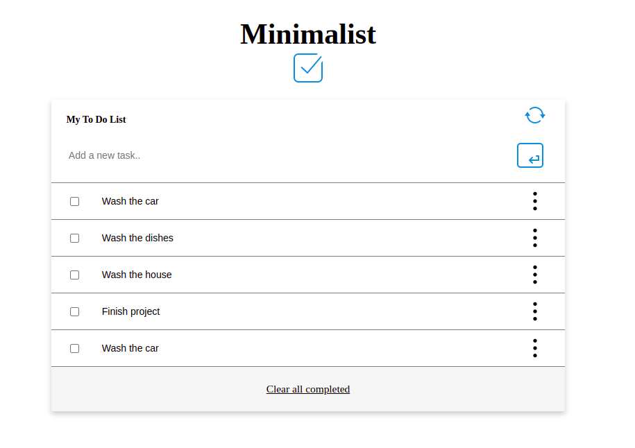

Desktop view

<h1 align="center"> A simple To Do list Web App</h1>

> The above screenshot shows the To Do List's UI. You can add a few items in your to-do list at this [link](https://benmuiruri.github.io/to-do-list/)

## Built With

- **HTML** and **CSS** and **Javascript**

## Getting Started

To get a local copy up and running follow these setup steps below.

### Setup

- Simply fork this project
- run `npm i `to install all dependencies
- run `npm run build` to bundle the project with webpack, and
- run `npm start` to launch the application
- In case you run into any errors please raise an [issue](https://github.com/Benmuiruri/to-do-list/issues).

## Authors

👤 **Author**

- GitHub: [@githubhandle](https://github.com/Benmuiruri)
- Twitter: [@twitterhandle](https://twitter.com/_optimize)
- LinkedIn: [LinkedIn](https://www.linkedin.com/in/benjamin-kiarie-180b66149/)

## 🤝 Contributing

Contributions, issues, and feature requests are welcome!

Feel free to check the [issues page](https://github.com/Benmuiruri/to-do-list/issues).

## Show your support

Give a ⭐️ if you like this project!

## Acknowledgments

- Huge thanks to [Sodiq](https://github.com/deyemiobaa) for his contribution and [Yasin](https://github.com/Yazino12) for his code review.

## 📝 License

This project is [MIT](https://opensource.org/licenses/MIT) licensed.
